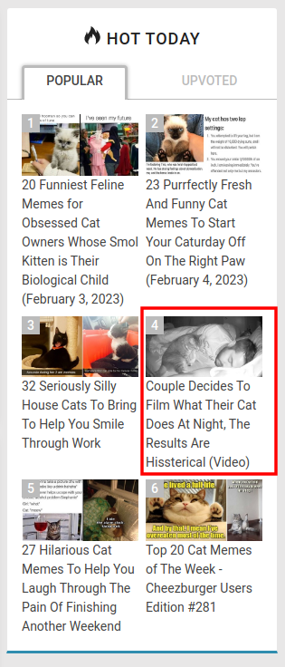
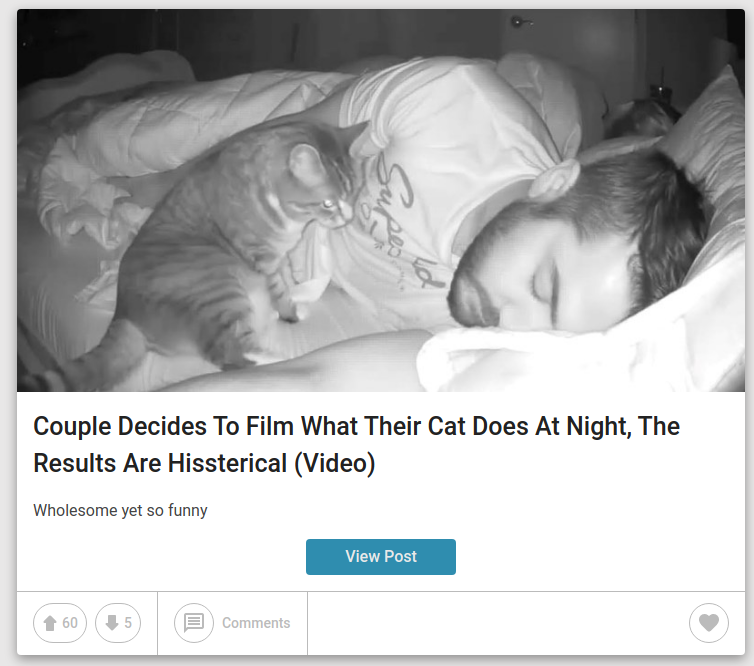

# Proper Case Challenge

Case Challenge for Proper, part of the interview process

Participant information

- Name: Manuel Panichelli
- Email: panicmanu@gmail.com
- LinkedIn: [/in/manuel-panichelli/](https://www.linkedin.com/in/manuel-panichelli/)

## Case 1

> **Assignment**: Write a program that downloads the images from
http://icanhas.cheezburger.com/ and stores them locally. Only download graphics
that are memes on the page and not sponsored content. Download the first ten
memes on the homepage and store them locally. Name them `1.jpg`, ..., `10.jpg`.

I started out by inspecting the page, and noticed that memes are all `img`
elements with the image urls on the `src` tags.

When I tried scraping the images, I'd get weird URLs in the `src` tag like
`data:image/gif;base64,R0lGODlhAQABAAAAACH5BAEAAAAALAAAAAABAAEAAAI=`. I realized
that's because it lazy loads images, and the `src` tag starts out with a dummy
value which is replaced with `data-src` later. So I considered both.

I found the scraping framework [`colly`](http://go-colly.org/) which seems easy
enough to use, so I'll use that from now on.

## Case 2

> **Assignment**: Extend the program to accept a parameter named `amount` that
determines how many memes need to be downloaded. Hint: if it's more than on the
first page, I expect the program to go to the next page.

Inspecting the page, I realized that the page links where just an `href` to
`/page/{pageNumber}`. I can take advantage of this by visiting
`https://icanhas.cheezburger.com/page/{pageNumber}` instead of doing something
more complicated that involves scraping to go to the next page.

To support flags, I'll just use the [`flag`](https://pkg.go.dev/flag) pkg
because it's simple. If it was more complicated I'd consider using something
like [`cobra`](https://github.com/spf13/cobra)

### Extra: Fix repeated images

Images are being downloaded twice because they appear on the "Hot today" section
and as a post on the homepage. For example, with this post

I noticed the sources are very similar, the only thing that changes is a part of
the URL.

- Hot today source: `https://i.chzbgr.com/thumb400/3749638/h1C7C74B7/at-night-thumbnail-includes-one-black-and-white-picture-of-a-cat-sitting-next-to-a-sleeping-man`
- Post source: `https://i.chzbgr.com/thumb800/3749638/h1C7C74B7/at-night-thumbnail-includes-one-black-and-white-picture-of-a-cat-sitting-next-to-a-sleeping-man`

The only thing that changes is the first part of the resource, `thumb800` and
`thumb400`. You can change it to some numbers, like 1200, and receive a scaled
image. Using `full` you get the full scale image.

To only download one version of every image, I'll change the URLs so that they
are all `full`. Then remove the duplicates.

## References

- Web Scraping
  - https://www.scrapingbee.com/blog/web-scraping-go/
  - http://go-colly.org/
- DOM: https://developer.mozilla.org/en-US/docs/Web/API/Document_Object_Model/Introduction
- CSS selectors: https://www.w3schools.com/cssref/css_selectors.php